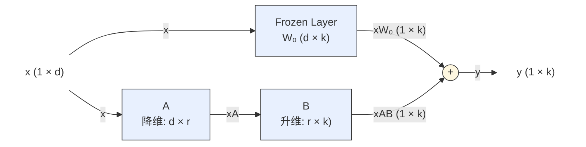
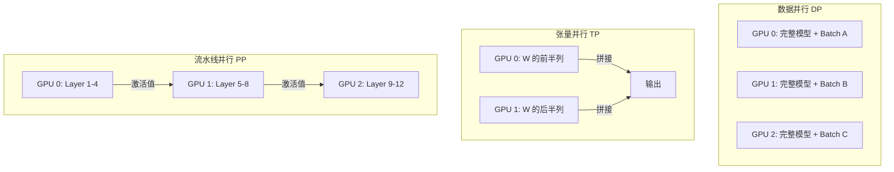

# L10: 大模型训练

> 随着大语言模型（LLM）参数规模不断扩大，其训练面临计算资源、存储资源、通信效率等多方面的挑战。本讲围绕大模型训练的核心挑战，介绍参数高效微调（LoRA）与并行训练技术（Data Parallel、Tensor Parallel、Pipeline Parallel）。配套实验代码：[code/l10-lenet5_ddp.py](../../code/l10-lenet5_ddp.py)（DDP 分布式训练示例）、[code/l10-llama_lora.py](../../code/l10-llama_lora.py)（LoRA 微调示例）。

---

## 目录

1. [大模型训练的核心挑战](#1-大模型训练的核心挑战)
2. [GPU 显存层级与存储分析](#2-gpu-显存层级与存储分析)
3. [Mini-batch 随机梯度下降](#3-mini-batch-随机梯度下降)
4. [参数高效微调：LoRA](#4-参数高效微调lora)
5. [并行与分布式训练](#5-并行与分布式训练)
6. [DDP 实验代码分析](#6-ddp-实验代码分析)
7. [Hugging Face 训练生态](#7-hugging-face-训练生态)
8. [关键知识点总结](#8-关键知识点总结)

---

## 1. 大模型训练的核心挑战

相比传统深度学习模型，大模型通常具有数十亿甚至数千亿参数，其训练过程对计算资源、存储资源以及通信效率均提出了更高要求。主要挑战包括以下四个方面。

### 1.1 参数规模巨大

模型参数规模可达 T 级别，导致存储和计算成本极高。下表列出了代表性大模型的训练系统参数：

| 公司 | 模型 | 发布时间 | 参数量 | 训练 Tokens | 训练规模 |
|------|------|---------|--------|------------|---------|
| OpenAI | GPT-3 | 2020 | 175B | ~1T 级别 | 数千 GPU；~3×10²³ FLOPs |
| Meta | LLaMA 3 | 2024 | 8B / 70B / 405B | ~10T 级别 | 万卡级 GPU 集群 |
| DeepSeek | DeepSeek-V3 | 2024 | 671B（37B activated） | ~10T 级别 | 千卡级 H800 GPU 集群 |

### 1.2 内存占用高

除了存储参数本身，训练过程中还需要处理海量的上下文序列（百万级 token）和梯度累积，模型参数、梯度以及中间激活值会占用大量显存，并带来显著的存储与内存带宽开销。以 FP16 精度的 32B 模型为例：

| 精度 | 单参数字节数 | 32B 模型显存 |
|------|------------|-------------|
| FP16 / BF16 | 2 bytes | 64 GB |
| INT8 量化 | 1 byte | 32 GB |
| INT4 量化 | 0.5 byte | 16 GB |

### 1.3 计算资源需求巨大

训练过程涉及大量矩阵运算，需要高性能 GPU 集群（数千至数万卡）才能支撑。单个计算设备通常难以完成训练，必须依赖多 GPU 或 TPU 集群进行分布式训练。即使在数据并行与模型并行等训练范式中，不同设备间频繁的参数与梯度同步，也使通信延迟与带宽限制成为制约训练效率的关键瓶颈。

### 1.4 高质量数据稀缺

当前互联网数据中真正可用于大模型训练的高质量文本数据相对有限。经过清洗、去重、质量过滤及版权筛查后，可用于大规模语言模型预训练的高质量公开文本数据规模约为数十万亿（10–100T）词元量级。例如 FineWeb 数据集包含约 15T 英文词元，RedPajama V2 达到约 30T 词元规模。

针对上述挑战，当前研究主要从两条技术路径展开：一是**参数高效微调方法**，通过仅更新少量参数以降低模型微调的计算与存储开销；二是**并行与分布式训练技术**，通过数据并行、模型并行以及流水线并行等方式提升大模型训练效率。

---

## 2. GPU 显存层级与存储分析

### 2.1 显存层级结构

GPU 的存储系统由多个层级组成，不同层级在容量和访问速度上存在显著差异：

| 存储层级 | 容量 | 速度 | 存储内容 |
|---------|------|------|---------|
| 寄存器（Register） | KB 级 | 最快 | 当前正在计算的单个值/向量 |
| SRAM（L1/L2 cache，共享内存） | MB 级 | 快 | 当前层的权重分片、中间结果 |
| HBM（高带宽显存） | 16–80 GB | 慢于 SRAM | 全部参数 + KV Cache + 激活值 |

模型参数、KV Cache 和激活值均存储在 HBM 中，而非寄存器或 SRAM。计算时，数据需从 HBM 加载到片上（SRAM/寄存器），计算完成后再写回 HBM：

```
HBM（存参数 + KV Cache）→ SRAM（加载到片上）→ 寄存器（逐元素计算）→ 写回 HBM
```

### 2.2 推理时的显存构成

以 32B 模型、序列长度 2048 为例，推理时的显存占用近似为：

```
总显存 ≈ 模型参数 + KV Cache + 激活值缓冲
       ≈ 64 GB + 数 GB + 数百 MB
```

**KV Cache** 是推理时的主要额外开销。Transformer 的自回归推理中，每层每个 token 需要存储 Key 和 Value 向量，其规模为：

```
KV Cache 大小 ∝ 层数 × 序列长度 × hidden_dim × 2(K+V) × bytes
```

### 2.3 Flash Attention 的优化思路

在标准注意力计算中，注意力矩阵需要写回 HBM 再读取，带来大量访存开销。**Flash Attention** 的核心优化是让中间注意力矩阵不写回 HBM，全程在 SRAM 中完成计算（通过分块/tiling 技术实现），从而显著减少显存带宽压力。这一思想与本课程第 8 讲的算子融合一脉相承。

---

## 3. Mini-batch 随机梯度下降

### 3.1 三种梯度下降方式对比

| 方式 | batch size | 特点 |
|------|-----------|------|
| Batch GD（批量梯度下降） | 全部数据 | 梯度准确，但慢、费显存 |
| SGD（随机梯度下降） | 1 个样本 | 快，但梯度噪声大 |
| Mini-batch SGD | 32 / 64 / 128 / ... | 折中，最常用 |

Mini-batch 是训练时一次送入模型的一小批样本，而非全部数据。它是当前深度学习训练中最主流的方式。

### 3.2 为什么使用 Mini-batch

1. **节省内存**：像 32B 模型不可能一次处理所有样本，必须分批。
2. **梯度足够准确**：几十个样本的梯度均值已经足够接近真实梯度，统计意义上是无偏估计。
3. **GPU 并行**：矩阵乘法天然适合并行，batch 越大 GPU 利用率越高。

### 3.3 batch_size 与显存的关系

batch_size 直接影响激活值的显存占用：

```
激活值显存 ∝ batch_size × 序列长度 × hidden_dim
```

因此，batch_size 的选择需要在 GPU 利用率与显存容量之间权衡。

### 3.4 梯度累积（Gradient Accumulation）

当显存不足以容纳较大的 batch_size 时，可采用**梯度累积**技术：在多个小 batch 上分别计算梯度但不立即更新参数，而是将梯度累加起来，累积若干步后再执行一次参数更新。这样可以在不增加显存占用的前提下，等效地实现大 batch 训练的效果。

```python
# 梯度累积示例
accumulation_steps = 8
for i, (inputs, labels) in enumerate(loader):
    outputs = model(inputs)
    loss = criterion(outputs, labels) / accumulation_steps  # 缩放损失
    loss.backward()  # 梯度累积，而非立即更新
    if (i + 1) % accumulation_steps == 0:
        optimizer.step()
        optimizer.zero_grad()
```

---

## 4. 参数高效微调：LoRA

参数高效微调（Parameter-Efficient Fine-Tuning, PEFT）技术通过仅训练少量额外参数，在保持模型性能的同时大幅降低资源消耗。其中最具代表性的是 **LoRA（Low-Rank Adaptation）**。

### 4.1 核心思想

LoRA 基于如下经验观察：在下游任务微调过程中，预训练大模型权重的有效更新 $\Delta W$ 往往具有较低的内在秩（low intrinsic rank），即模型性能的提升主要依赖于少数几个主方向上的参数变化。因此，无需学习完整的 $\Delta W$，而可以用低秩矩阵对其进行近似，从而显著减少可训练参数数量。

### 4.2 数学表达

LoRA 不直接更新完整的权重矩阵 $W$，而是在冻结原始预训练参数 $W_0$ 的基础上，引入两个低秩矩阵 $A$ 与 $B$ 来表示权重增量：

$$\Delta W = AB$$

其中，若输入向量为 $x \in \mathbb{R}^{1 \times d}$，原始权重矩阵为 $W_0 \in \mathbb{R}^{d \times k}$，则令：

$$A \in \mathbb{R}^{d \times r}, \quad B \in \mathbb{R}^{r \times k}$$

其中 $r \ll \min(d, k)$ 为低秩维度（rank）。新的权重为：

$$W = W_0 + \Delta W = W_0 + AB$$

前向传播过程中，模型输出变为：

$$xW = xW_0 + xAB$$

其中 $xW_0$ 由冻结的预训练参数计算得到，$xAB$ 表示 LoRA 学习到的低秩增量部分。

### 4.3 LoRA 原理示意图



### 4.4 参数节省分析

由于仅需训练矩阵 $A$ 与 $B$，可训练参数数量从原本的 $d \times k$ 降低为 $r(d + k)$。当 $r$ 很小时，参数规模与显存占用都将显著下降。

以 $d = k = 4096$、$r = 8$ 为例：

- 原始参数量：$d \times k = 4096 \times 4096 = 16{,}777{,}216$
- LoRA 参数量：$r(d + k) = 8 \times (4096 + 4096) = 65{,}536$
- 可训练参数占比：$65536 / 16777216 \approx 0.39\%$

即仅训练约 0.39% 的参数即可完成微调，极大降低了计算与存储开销。

### 4.5 缩放系数

为了稳定训练，LoRA 通常还引入缩放系数 $\alpha$，将权重更新写为：

$$W = W_0 + \frac{\alpha}{r} AB$$

其中 $\alpha$ 用于控制低秩更新项的幅度，避免训练初期对原模型分布造成过大扰动。

### 4.6 LoRA 的优势

1. **参数与显存高效**：仅需训练少量低秩参数，显存占用与训练成本显著降低。
2. **不修改原始模型**：LoRA 不会修改预训练模型参数，不同任务对应的 LoRA 权重可以独立保存与切换。部署时只需加载基础模型与对应的 LoRA 参数即可快速适配不同任务。
3. **应用位置灵活**：在 Transformer 中，LoRA 通常应用于注意力机制中的线性投影层（Query、Key、Value 或 Output Projection），其中对 Query 与 Value 矩阵进行低秩适配最为常见。

LoRA 可通过 Hugging Face 的 PEFT 库等工具直接使用，配套示例见 [code/l10-llama_lora.py](../../code/l10-llama_lora.py)。

---

## 5. 并行与分布式训练

随着大语言模型参数规模不断增长，单张 GPU 已难以满足训练所需的显存与计算需求。例如，一个 7B 参数规模的 Transformer 模型，若采用 FP16 精度，仅模型参数本身就需要约 $7 \times 10^9 \times 2 \text{ Bytes} \approx 14 \text{ GB}$，加上梯度和优化器状态等信息，实际训练显存往往达到参数量的数倍。

主流的并行训练方式可分为以下几类：

| 并行方式 | 切分对象 | 说明 |
|---------|---------|------|
| 数据并行（Data Parallel） | 训练数据 | 每张 GPU 持有完整模型副本，处理不同数据 batch |
| 全分片数据并行（FSDP） | 存储参数 | 参数与梯度等信息在多 GPU 间分片存储，计算时按需聚合 |
| 张量并行（Tensor Parallel） | 算子计算（横向） | 将单层算子按张量维度切分到多 GPU 上并行计算 |
| 流水线并行（Pipeline Parallel） | 层级（纵向） | 将模型按层划分为多个 stage，不同 GPU 负责不同层 |

### 5.1 数据并行（Data Parallel）

#### 基本思想

每张 GPU 持有一份完整模型副本，并分别处理不同的 mini-batch 数据，从而提升整体训练吞吐量。

需要注意的是，**数据并行不能解决模型过大导致的显存不足问题**，因为每张 GPU 仍需存储完整模型参数与优化器状态。

#### DataParallel（DP）

PyTorch 提供的基础数据并行接口：

```python
model = torch.nn.DataParallel(model)
model = model.cuda()
```

其执行流程为：主 GPU 负责参数广播与结果汇总；输入 mini-batch 被拆分并分发到多个 GPU；各 GPU 独立执行前向与反向传播；各 GPU 的梯度在主 GPU 上聚合后更新参数。该方法实现简单，但由于存在主卡通信与汇总瓶颈，扩展性较差，已逐渐不被推荐。

#### DistributedDataParallel（DDP）

DDP 是 PyTorch 官方推荐的标准数据并行方式。它基于 NVIDIA 的 NCCL（NVIDIA Collective Communications Library）后端实现高效 GPU 间通信，采用**去中心化的 All-Reduce 机制**进行梯度同步，避免了传统参数服务器架构中的中心节点瓶颈，具有更好的扩展性与计算效率。

在 DDP 中，每张 GPU 计算本地梯度后，自动触发 All-Reduce 操作，使所有 GPU 的梯度变为全局平均值，用户无需手写通信代码。训练流程通过 `torchrun` 启动：

```bash
torchrun --nproc_per_node=2 train.py
```

其中 `nproc_per_node` 表示使用的 GPU 数量，每张 GPU 对应一个独立进程，PyTorch 自动完成进程间通信初始化。

### 5.2 参数并行

在大语言模型训练中，模型参数规模通常远超单卡显存容量，因此无法仅通过数据并行扩展。参数相关的并行方法本质上是通过切分模型中的张量降低单卡的存储或计算压力。

#### 全分片数据并行（FSDP）

FSDP 的核心思想是对**参数存储**进行切分，而不改变计算方式。模型所有参数（包括 attention 与 FFN 层）会被 flatten 成连续向量，并在数据并行维度上均匀切分，使得每张 GPU 仅保存约 $\frac{1}{N}$ 的参数、梯度及优化器状态。

前向传播时，当某一层参与计算，其参数分片会通过 all-gather 临时恢复为完整矩阵；计算完成后立即释放完整参数，仅保留本地分片。反向传播过程中，梯度通过 reduce-scatter 操作同步并重新切分。

FSDP 的本质目标是**降低显存占用**，使模型可以在多 GPU 上存得下。

#### 张量并行（Tensor Parallel, TP）

与 FSDP 不同，张量并行直接对**计算过程**进行切分。其基本思想是将同一层中的矩阵运算拆分到不同 GPU 上独立计算，而不是先恢复完整参数再计算。

以 attention 中的线性映射为例，$W_Q, W_K, W_V \in \mathbb{R}^{d_{model} \times (H d_k)}$ 可以沿 head 维度或列维度拆分为多个子矩阵：

$$W_Q = [W_Q^{(1)}, W_Q^{(2)}, \ldots, W_Q^{(N)}]$$

每张 GPU 只负责计算对应部分 $q_i^{(n)} = x_i W_Q^{(n)}$，最终再对各个 head 的输出进行拼接或聚合。

张量并行的本质目标是**降低单层计算压力**，使大矩阵乘法可以在多 GPU 上并行执行。

#### 流水线并行（Pipeline Parallel, PP）

流水线并行从**模型深度**维度对模型进行划分。其核心思想是将一个深层 Transformer 按层划分为多个连续的子网络（stage），并分配到不同 GPU 上执行：

$$\text{Block}_1 \sim \text{Block}_k \rightarrow \text{Block}_{k+1} \sim \text{Block}_{2k} \rightarrow \cdots$$

每个 GPU 只负责其中一段网络的前向与反向计算。前向传播时，输入 token 表示首先进入第一段计算，其输出作为激活值传递给下一 GPU，直到得到最终 logits。这一过程类似于工业生产中的流水线，因此称为 pipeline。

### 5.3 三种并行的对比



### 5.4 实际训练中的典型组合

在当前主流大语言模型训练中，通常不会单独使用某一种并行方式，而是将多种技术组合使用：

- **DDP / FSDP**：实现数据并行与参数状态分片；
- **Tensor Parallel**：切分单层矩阵计算，提升算子级并行度；
- **Pipeline Parallel**：将深层 Transformer 按层划分，扩展模型在深度方向上的可训练规模。

此外，还常配合多种系统级优化策略：

- **ZeRO**：进一步降低优化器状态与梯度的显存占用；
- **FP16/BF16 混合精度**：减少计算与存储开销；
- **Gradient Checkpointing**：以计算换显存，降低前向激活的存储压力。

现代大语言模型训练已经不再是单纯的模型优化问题，而是一个高度系统化的分布式工程问题，其核心约束来自 GPU 间通信效率、显存层级管理、参数与计算的切分策略以及集群网络带宽等多个因素的综合权衡。

---

## 6. DDP 实验代码分析

配套实验代码 [code/l10-lenet5_ddp.py](../../code/l10-lenet5_ddp.py) 演示了使用 PyTorch DDP 对 LeNet-5 在 MNIST 数据集上进行分布式训练的完整流程。启动方式：

```bash
torchrun --nproc_per_node=2 code/l10-lenet5_ddp.py
```

### 6.1 DDP 初始化

DDP 训练的核心初始化流程包括两步：初始化进程组（建立所有 GPU 间的通信桥梁），以及将每个进程绑定到一个 GPU：

```python
def setup_ddp():
    # 1. 初始化进程组（所有 GPU 通信桥梁）
    dist.init_process_group(backend="nccl")
    # 2. 每个进程绑定一个 GPU
    local_rank = int(os.environ["LOCAL_RANK"])
    torch.cuda.set_device(local_rank)
    return local_rank
```

### 6.2 数据切分

DDP 的关键在于数据切分：使用 `DistributedSampler` 将训练数据分配到不同 GPU 上，每个 GPU 处理不同的子集。需要注意的是，使用 `DistributedSampler` 时不能同时设置 `shuffle=True`：

```python
# DDP 关键：数据切分
train_sampler = DistributedSampler(train_dataset, shuffle=True)
train_loader = DataLoader(
    train_dataset,
    batch_size=64,
    sampler=train_sampler,  # 不能同时用 shuffle=True
)
```

### 6.3 模型封装与梯度同步

模型通过 `DDP` 封装后，梯度同步在 `loss.backward()` 时自动触发——每个 GPU 计算本地梯度后，自动触发 All-Reduce，使梯度变为全局平均值，用户无需手写通信代码：

```python
# DDP 封装
model = LeNet5().to(device)
model = DDP(model, device_ids=[local_rank])

# 训练循环
for epoch in range(epochs):
    train_sampler.set_epoch(epoch)  # 保证每个 epoch shuffle 不同
    for inputs, labels in train_loader:
        outputs = model(inputs)
        loss = criterion(outputs, labels)
        optimizer.zero_grad()
        loss.backward()  # DDP 自动触发 All-Reduce 同步梯度
        optimizer.step()
```

### 6.4 关键细节

- **`set_epoch`**：每个 epoch 必须调用 `train_sampler.set_epoch(epoch)`，否则所有 epoch 的数据划分相同。
- **模型保存**：只需 rank 0 进程保存模型，通过 `model.module.state_dict()` 获取原始模型（剥离 DDP 包装）的参数。
- **进程清理**：训练结束后调用 `dist.destroy_process_group()` 清理环境。

---

## 7. Hugging Face 训练生态

Hugging Face 已成为当前自然语言处理领域最重要的开源生态之一，提供了一套端到端的大模型开发与训练框架，涵盖模型加载、数据处理、分布式训练、参数高效微调（PEFT）以及模型发布等环节。

### 7.1 核心组件

| 库 | 功能 |
|---|------|
| `transformers` | Transformer 模型实现与预训练权重，支持 LLaMA 等主流模型 |
| `datasets` | 统一的数据集加载与预处理接口，支持流式读取与大规模数据处理 |
| `tokenizers` | 高性能 tokenizer，用于文本与词元序列之间的转换 |
| `peft` | 参数高效微调方法，包括 LoRA、Prefix Tuning、Prompt Tuning 等 |
| `Trainer` | 高层训练接口，自动封装训练循环、混合精度、checkpoint 保存及 DDP/FSDP |

### 7.2 LoRA 微调示例

以 LLaMA-3 模型为例，使用 Hugging Face 与 PEFT 进行 LoRA 微调的核心流程：

```python
from transformers import AutoModelForCausalLM, AutoTokenizer, TrainingArguments, Trainer
from peft import LoraConfig, get_peft_model
from datasets import load_dataset
import torch

# 加载预训练模型（BF16 混合精度降低显存开销）
tokenizer = AutoTokenizer.from_pretrained("meta-llama/Meta-Llama-3-8B")
model = AutoModelForCausalLM.from_pretrained(
    "meta-llama/Meta-Llama-3-8B",
    torch_dtype=torch.bfloat16
)

# 配置 LoRA
peft_config = LoraConfig(
    r=8,                        # 低秩矩阵 rank
    lora_alpha=32,              # LoRA 缩放系数
    target_modules=["q_proj", "v_proj"],  # 在哪些线性层插入 LoRA adapter
    task_type="CAUSAL_LM"
)

# 注入 LoRA adapter：原始预训练参数默认冻结，仅 LoRA 参数参与训练
model = get_peft_model(model, peft_config)
model.print_trainable_parameters()  # 输出可训练参数比例
```

### 7.3 启用分布式训练

在 Hugging Face Trainer 中启用 FSDP：

```python
training_args = TrainingArguments(
    ...,
    fsdp="full_shard auto_wrap",
    fsdp_transformer_layer_cls_to_wrap="LlamaDecoderLayer",
)
```

通过 `torchrun` 启动多 GPU 分布式训练：

```bash
torchrun --nproc_per_node=4 train.py
```

完整 LoRA 微调示例见 [code/l10-llama_lora.py](../../code/l10-llama_lora.py)。

---

## 8. 关键知识点总结

### 8.1 大模型训练的四大挑战

- **参数规模巨大**：T 级别参数，存储与计算成本极高；
- **内存占用高**：参数、梯度、激活值、KV Cache 共同消耗显存；
- **计算资源需求巨大**：需要数千至数万卡 GPU 集群；
- **高质量数据稀缺**：可用于预训练的高质量文本数据约数十万亿词元。

### 8.2 LoRA 的核心

- 冻结预训练参数 $W_0$，仅训练低秩矩阵 $A$ 和 $B$，其中 $\Delta W = AB$；
- 参数量从 $d \times k$ 降至 $r(d + k)$（$r \ll \min(d, k)$）；
- 不修改原始模型，不同任务的 LoRA 权重可独立切换。

### 8.3 三种并行的本质

| 并行方式 | 切分维度 | 解决的问题 |
|---------|---------|-----------|
| 数据并行（DDP） | 数据 | 单卡算力不足 |
| 张量并行（TP） | 算子内部 | 单层计算压力 |
| 流水线并行（PP） | 模型层级 | 模型深度过大 |
| FSDP | 参数存储 | 显存容量不足 |

实际训练中，这几种并行方式通常组合使用，并配合 ZeRO、混合精度、Gradient Checkpointing 等系统级优化。

### 8.4 GPU 显存层级

- 寄存器（KB）→ SRAM（MB）→ HBM（GB），速度递减、容量递增；
- 参数、KV Cache、激活值存储在 HBM，计算时需搬运到片上；
- 减少访存开销（如算子融合、Flash Attention）是性能优化的关键。


---

## 附录：代码文件索引

| 文件 | 说明 |
|------|------|
| `code/l10-lenet5_ddp.py` | DDP（DistributedDataParallel）分布式训练示例 |
| `code/l10-llama_lora.py` | LoRA 低秩微调示例（PEFT） |
| `notes/L10-大模型训练.pdf` | 课程讲义原文 |
