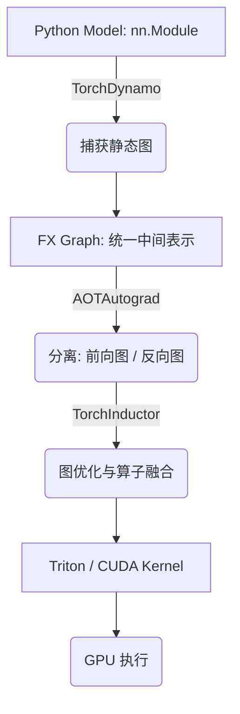
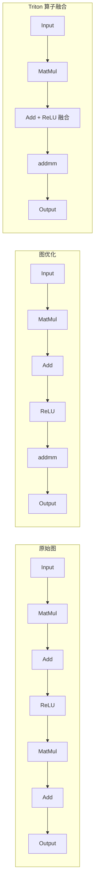
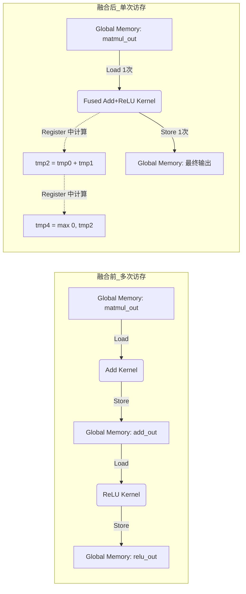
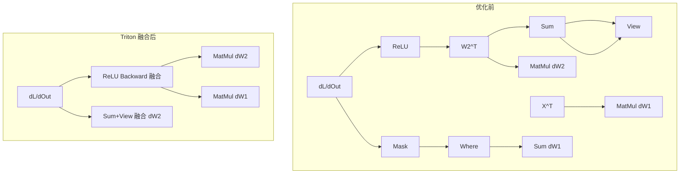

# L8: 算子融合与 PyTorch 计算图优化

> 本讲围绕 PyTorch 2.x 的 `torch.compile` 编译流程，分析算子融合（Operator Fusion）的原理及其在 GPU 上的实现。核心组件链路为：**TorchDynamo 捕获计算图 → AOTAutograd 拆分前后向 → TorchInductor 做算子融合并生成 Triton Kernel**。配套实验代码见 [lec8-mlp.py](lec8-mlp.py)（仓库根目录对应 [code/l8-mlp.py](../../code/l8-mlp.py)）。

---

## 目录

1. [算子融合的动机：访存开销分析](#1-算子融合的动机访存开销分析)
2. [实验模型与编译配置](#2-实验模型与编译配置)
3. [torch.compile 编译流水线](#3-torchcompile-编译流水线)
4. [前向计算图优化分析](#4-前向计算图优化分析)
5. [算子融合实例：output_code.py 解析](#5-算子融合实例output_codepy-解析)
6. [反向计算图优化分析](#6-反向计算图优化分析)
7. [调试产物与日志解读](#7-调试产物与日志解读)
8. [max_autotune_gemm 警告说明](#8-max_autotune_gemm-警告说明)
9. [性能分析工具：nsys](#9-性能分析工具nsys)
10. [预热、cuBLAS 与 Autotune 搜索](#10-预热cublas-与-autotune-搜索)
11. [关键知识点总结](#11-关键知识点总结)
12. [课后练习](#12-课后练习)

---

## 1. 算子融合的动机：访存开销分析

### 1.1 访存与执行开销

以一个两层 MLP 模型为例，从内存访问角度分析其性能瓶颈。设输入为 $x \in \mathbb{R}^{B \times F}$，隐藏层维度为 $H$，该 MLP 前向传播主要包含两次矩阵乘法：

- 第一层：$(B \times F) \cdot (F \times H) \rightarrow (B \times H)$
- 第二层：$(B \times H) \cdot (H \times 1) \rightarrow (B \times 1)$

如果不考虑算子融合，矩阵乘法、bias 加法和 ReLU 均为独立算子。在 GPU 上，每个算子通常对应一次 kernel 启动，需要从全局内存读取输入数据，计算完成后再将结果写回全局内存，供后续算子使用。因此，算子之间的中间结果需要在全局内存中显式存储与传递。

在该模型中，$(B \times H)$ 的张量正是不同算子之间传递的中间激活，其访存次数如下表所示：

**表 8.1：MLP 前向传播访存分析**

| 阶段 | 读取（Read） | 写入（Write） | 主要张量 |
|------|-------------|--------------|---------|
| 第一层矩阵乘法 $XW_1$ | $BF + FH$ | $B \times H$ | $x, W_1$ |
| 第一层 bias 加法 | $B \times H + H$ | $B \times H$ | 中间激活, $b_1$ |
| ReLU 激活 | $B \times H$ | $B \times H$ | 中间激活 |
| 第二层矩阵乘法 $XW_2$ | $B \times H + H$ | $B$ | 激活, $W_2$ |
| 第二层 bias 加法 | $B + 1$ | $B$ | 输出, $b_2$ |
| **总计** | $\approx BF + FH + 3BH + 2H + 2B$ | $\approx 2BH + 2B$ | – |

从整体规模来看，访存主要由输入 $O(BF)$、权重 $O(FH)$ 以及中间激活 $O(BH)$ 构成。其中，**中间激活在多个算子之间被反复读取与写回，是主要的数据搬运来源**。当 $B$ 和 $H$ 较大时，这部分开销占主导，使模型更容易受到内存带宽限制（memory bound）。

### 1.2 片上存储容量限制

该问题还受到 GPU 片上存储容量的影响。以 NVIDIA Ampere 架构为例，每个 SM 上共享内存约为 164 KB。当 $B=32, H=64$ 时，中间激活大小约为 8 KB（FP32），从容量上可以放入共享内存。但在实际执行中，还需同时存放输入、权重及其它线程块的数据，因此能够用于缓存中间激活的空间有限。随着 $B$ 或 $H$ 增大，中间激活规模按 $O(BH)$ 增长，很快无法完全驻留在共享内存中，只能频繁在全局内存与共享内存之间进行数据交换，从而增加访存开销。该问题通常通过分块（tiling）等方法提升局部数据复用（如分块矩阵乘法）来缓解。

### 1.3 算子融合的概念

算子融合（Operator Fusion）是深度学习框架中的重要优化技术，其核心思想是**将多个连续的算子合并为一个计算单元，从而减少中间张量的读写次数、降低内存访问开销，并提高计算效率**。

以全连接层为例，矩阵乘法与偏置加法两个独立操作 $y = xW + b$ 在 PyTorch 中已被实现为一个融合算子 `nn.Linear`，从而减少一次内存读写操作。改写后，原本由 5 个独立算子产生的全局内存读写，被减少为 3 个融合算子的读写操作，显著降低了访存开销。在此基础上，还可以进一步构造更大的融合算子（如将全连接层与 ReLU 合并），以继续减少中间结果的读写次数。

---

## 2. 实验模型与编译配置

### 2.1 MLP 模型定义

实验采用一个极简的两层感知机（MLP）拟合 $\sin(x)$。模型虽小，但前向计算图清晰规整，非常适合演示 `torch.compile` 的完整编译流程。完整代码见 [lec8-mlp.py](lec8-mlp.py)，核心结构如下：

```python
import torch
import torch.nn as nn
import torch.nn.functional as F

class MLP(nn.Module):
    def __init__(self, feature=1, hidden=64):
        super().__init__()
        # 第一层参数：输入特征维(1) -> 隐藏维(64)
        # 用 nn.Parameter 手动管理权重，便于观察底层对 add/matmul 的处理
        self.weight1 = nn.Parameter(torch.randn(feature, hidden))   # (F, H)
        self.bias1   = nn.Parameter(torch.randn(hidden))            # (H,)

        # 第二层参数：隐藏维(64) -> 输出维(1)
        self.weight2 = nn.Parameter(torch.randn(hidden, 1))         # (H, 1)
        self.bias2   = nn.Parameter(torch.randn(1))                 # (1,)

    def forward(self, x):
        # 算子集合 1：矩阵乘法 (matmul) + 偏置相加 (add)
        x = x @ self.weight1 + self.bias1   # (B, H)
        # 算子集合 2：激活函数 (relu)
        # 编译器的一大任务就是考察能否把 add 和 relu 融合 (Fusion)
        x = torch.relu(x)
        # 算子集合 3：第二层计算
        x = x @ self.weight2 + self.bias2   # (B, 1)
        return x
```

该模型的前向传播包含 5 个算子：`matmul → add → relu → matmul → add`，其中逐点操作（pointwise）`add` 与 `relu` 是最适合融合的对象。

### 2.2 开启编译加速

模型实例化并迁移至 GPU 后，通过 `torch.compile` 启用计算图级别优化：

```python
device = "cuda"
batch_size = 128
torch.manual_seed(0)  # 固定随机种子以确保图捕获和生成 kernel 的一致性

model = MLP(hidden=64).to(device)

# 核心关键：使用 torch.compile 开启 PyTorch 2.x 编译加速
# backend="inductor": 使用 TorchInductor 作为代码生成后端
# mode="default": 默认模式，在编译时间和运行性能之间取得平衡
model = torch.compile(model, backend="inductor", mode="default")

optimizer = torch.optim.Adam(model.parameters(), lr=1e-3)

for step in range(500):
    x = torch.rand(batch_size, 1, device=device) * 2 * torch.pi
    with torch.no_grad():
        y = torch.sin(x)
    out = model(x)
    loss = F.mse_loss(out, y)
    optimizer.zero_grad()
    loss.backward()
    optimizer.step()
    if step % 50 == 0:
        print(f"step {step}, loss = {loss.item():.6f}")
```

### 2.3 `torch.compile` 的关键参数

`torch.compile` 是 PyTorch 2.x 提供的图编译接口，其函数签名支持多个关键参数，用于控制计算图捕获方式、优化策略及执行后端：

| 参数 | 说明 |
|------|------|
| `model` | 待编译的 PyTorch 模型或函数（必选） |
| `backend="inductor"` | 指定编译后端，默认使用 TorchInductor |
| `mode` | 控制编译优化策略的预设模式 |
| `fullgraph=False` | 是否强制进行完整计算图捕获 |
| `dynamic=False` | 是否启用动态形状支持 |

`mode` 的常见选项：

- **`"default"`**：默认模式，在编译时间与运行性能之间取得平衡。
- **`"reduce-overhead"`**：减少 Python 调度与框架开销，适用于小模型或频繁调用场景。
- **`"max-autotune"`**：通过更激进的 kernel 搜索获得最高运行性能，但编译时间显著增加。

`fullgraph=True` 时，若执行过程中发生 graph break（如 Python 控制流无法静态追踪），将直接报错，从而保证图优化的完整性，但会降低兼容性。`dynamic=True` 时，模型允许输入张量 shape 在运行时变化，但可能限制部分静态图优化（如算子融合与内存优化）。

---

## 3. torch.compile 编译流水线

`torch.compile` 的优化流程以 **FX Graph** 作为统一的中间表示（IR），整体由 TorchDynamo、AOTAutograd 与 TorchInductor 三个组件协同完成。



### 3.1 TorchDynamo：计算图捕获

TorchDynamo 负责在运行时捕获 Python 程序中的张量操作，将动态图转换为静态计算图（FX Graph）。其目标是在不改变用户代码的前提下，实现图级分析与优化的入口。日志中可直接观察到捕获过程的启动：

```text
Step 1: torchdynamo start tracing forward ...
```

由于本实验中的 MLP 模型没有复杂分支、数据依赖上的不确定性或动态控制流，TorchDynamo 可以完整捕获前向图，不会出现 graph break。

### 3.2 FX Graph：统一中间表示

FX Graph 作为统一的中间表示（IR），描述模型的计算结构：

- **节点**：算子，例如 `matmul`、`add`、`relu`
- **边**：张量数据流

该阶段支持符号追踪（symbolic tracing）以及图变换（graph rewrite），为后续优化提供基础。后端可以在统一 IR 上进行图变换、节点重排、算子融合和内存规划。

### 3.3 AOTAutograd：前后向拆分

AOTAutograd（Ahead-Of-Time Autograd）将自动求导过程提前展开，把前向计算与反向梯度计算分离成两个独立的计算图。这样做的好处是：

- 前向和反向可以采用不同的优化策略；
- 中间张量的生命周期更清楚；
- 更容易安排内存复用与缓存。

### 3.4 TorchInductor：优化与代码生成

TorchInductor 是最终真正把图"落地"的编译后端。它对计算图进行多层级优化，并基于中间表示进行调度（scheduling），最终生成高性能后端代码（GPU 上生成 Triton kernel 或调用底层高性能实现）。其工作包括：图级优化、算子融合（fusion）、调度、代码生成。

### 3.5 核心思想

`torch.compile` 的核心不是简单的加速开关，而是把原本在 Python 中逐条执行的张量操作：

1. 先捕获成图（TorchDynamo）；
2. 在图上做优化（AOTAutograd 拆分前后向 + TorchInductor 融合与调度）；
3. 最后生成更高效的 GPU kernel（Triton）。

---

## 4. 前向计算图优化分析

通过 `TORCH_COMPILE_DEBUG=1` 环境变量，可以导出编译过程中的中间表示与生成代码。前向计算图的优化过程可分为三个阶段：原始图 → 图变换 → 算子融合。

### 4.1 优化过程图示



### 4.2 优化前的 FX Graph（fx_graph_readable.py）

导出的 [fx_graph_readable.py](example_debug_artifacts/model__0_forward_1.0/fx_graph_readable.py) 直接展示了从 Python 代码捕获的计算图。该计算图的返回值列表 `[add_1, primals_4, relu, permute_2]` 为后续反向传播与编译优化提供了必要的计算上下文：

```python
class GraphModule(torch.nn.Module):
    def forward(self,
        primals_1: "f32[1, 64]",      # weight1: 第一层权重 (1 -> 64)
        primals_2: "f32[128, 1]",     # input: 输入数据 (batch=128, features=1)
        primals_3: "f32[64]",         # bias1: 第一层偏置
        primals_4: "f32[64, 1]",      # weight2: 第二层权重 (64 -> 1)
        primals_5: "f32[1]"           # bias2: 第二层偏置
    ):
        # ---------------- 第一层：Linear + ReLU ----------------
        # 矩阵乘法: (128,1) @ (1,64) -> (128,64)
        mm: "f32[128, 64]" = torch.ops.aten.mm.default(primals_2, primals_1)
        primals_1 = None  # FX 内存优化标记：显式置空，提示运行时可提前释放显存
        # 加法（广播）: (128,64) + (64,) -> (128,64)
        add: "f32[128, 64]" = torch.ops.aten.add.Tensor(mm, primals_3)
        mm = primals_3 = None  # 释放中间变量，降低峰值内存占用
        # ReLU 激活
        relu: "f32[128, 64]" = torch.ops.aten.relu.default(add)
        add = None

        # ---------------- 第二层：Linear ----------------
        # 矩阵乘法: (128,64) @ (64,1) -> (128,1)
        mm_1: "f32[128, 1]" = torch.ops.aten.mm.default(relu, primals_4)
        # 加法（广播）: (128,1) + (1,) -> (128,1)
        add_1: "f32[128, 1]" = torch.ops.aten.add.Tensor(mm_1, primals_5)
        mm_1 = primals_5 = None

        # ---------------- 用于梯度计算 ----------------
        permute_2: "f32[1, 128]" = torch.ops.aten.permute.default(primals_2, [1, 0])  # input_x.T
        primals_2 = None

        return (add_1, primals_4, relu, permute_2)
```

各返回值在梯度计算中的作用如下：

| 返回值 | 形状 | 梯度计算 | 作用说明 |
|--------|------|---------|---------|
| `add_1` | `[128, 1]` | $\partial L / \partial \text{add}_1$ | 模型最终输出张量，用于计算损失函数 |
| `primals_4` | `[64, 1]` | $\partial L / \partial W_2$ | 第二层权重 $W_2$，用于权重梯度计算 |
| `relu` | `[128, 64]` | $\partial L / \partial W_2$ | 隐藏层输出，用于计算 $\partial L/\partial W_2 = \text{relu}^\top \cdot \partial L/\partial \text{add}_1$ |
| `permute_2` | `[1, 128]` | $\partial L / \partial W_1$ | 输入张量转置 $X^\top$，用于计算 $\partial L/\partial W_1 = X^\top \cdot \partial L/\partial \text{relu}$ |

### 4.3 图变换后的 FX Graph（fx_graph_transformed.py）

经过图变换优化后，`add + matmul` 的组合被识别并替换为更高效的融合算子 `addmm`：

```python
# 优化前（分步执行）:
mm_1 = torch.ops.aten.mm.default(relu, primals_4)
add_1 = torch.ops.aten.add.Tensor(mm_1, primals_5)

# 优化后（融合为 addmm）:
addmm_default = torch.ops.aten.addmm.default(
    primals_5,    # bias2
    relu,         # input
    primals_4     # weight2
)
```

`addmm` 将偏置加法与矩阵乘法合并为一个算子，减少了中间结果的读写。这正是 `nn.Linear` 等高层 API 内部利用的优化。

---

## 5. 算子融合实例：output_code.py 解析

TorchInductor 最终将 FX Graph 降阶（lowering）为可在 GPU 上执行的 Triton Kernel。完整生成代码见 [output_code.py](output_code.py) 或 [example_debug_artifacts/model__0_forward_1.0/output_code.py](example_debug_artifacts/model__0_forward_1.0/output_code.py)。

### 5.1 融合后的 Triton Kernel

最关键的算子融合发生在第一层的 `add`（加偏置）与 `relu`（激活）之间。编译器自动将这两个逐点操作合并为一个名为 `triton_poi_fused_add_relu_0` 的 Pointwise 算子：

```python
@triton.jit
def triton_poi_fused_add_relu_0(in_out_ptr0, in_ptr0, xnumel, XBLOCK : tl.constexpr):
    xnumel = 8192
    xoffset = tl.program_id(0) * XBLOCK
    xindex = xoffset + tl.arange(0, XBLOCK)[:]
    xmask = tl.full([XBLOCK], True, tl.int1)[:]
    x2 = xindex
    x0 = (xindex % 64)

    # 1. Load: 读取前一层 matmul 的输出 (in_out_ptr0) 和 bias (in_ptr0)
    tmp0 = tl.load(in_out_ptr0 + (x2), None)
    tmp1 = tl.load(in_ptr0 + (x0), None, eviction_policy='evict_last')

    # 2. Compute: add 计算 (x + bias1)
    tmp2 = tmp0 + tmp1

    # 3. Compute: relu 计算 (即 maximum(0, x))
    tmp3 = tl.full([1], 0, tl.int32)
    tmp4 = triton_helpers.maximum(tmp3, tmp2)

    # 4. Store: 统一写回 global memory
    tl.store(in_out_ptr0 + (x2), tmp4, None)
```

### 5.2 融合前后的访存对比



**核心结论：**

- **融合了什么**：编译器自动把 `add`（加上 bias）和 `relu`（非线性激活）合并进了一个 Pointwise 算子中。
- **不融合时的开销**：需要先算加法，结果写回 Global Memory；再启动一个 ReLU kernel，从 Global Memory 把数据读出来，判断大于 0 后再写回。这涉及两次慢速的 Global Memory 读写。
- **融合后的收益**：加法结果 `tmp2` 到 ReLU 结果 `tmp4` 全程都在寄存器（Registers）里完成，极大减少了访存开销。对于显存带宽受限（Memory Bound）的 GPU 计算，这种优化比单纯提高算力收益更大。

此外，生成的执行代码中还体现了**内存复用**策略。`buf1 = buf0; del buf0` 表示复用同一块显存缓冲区，无需额外分配，进一步降低峰值显存占用。

---

## 6. 反向计算图优化分析

反向传播由于自动微分机制，其计算图比前向更复杂。AOTAutograd 将其静态展开后，TorchInductor 同样对其执行算子融合。

### 6.1 反向计算图的结构

反向传播需要计算四组梯度：$\partial L/\partial W_2$、$\partial L/\partial b_2$、$\partial L/\partial W_1$、$\partial L/\partial b_1$。优化前的反向 FX Graph 结构如下：

```python
class GraphModule(torch.nn.Module):
    def forward(self,
        relu: "f32[128, 64]",           # forward 中间激活值（ReLU 输出）
        primals_4: "f32[64, 1]",         # W2（第二层权重）
        permute_2: "f32[1, 128]",        # X^T（第一层输入转置）
        tangents_1: "f32[128, 1]"        # dL/dOutput（loss 对输出的梯度）
    ):
        # dL/db2 = sum_batch（对 batch 维度求和：128 → 1）
        sum_1 = torch.ops.aten.sum.dim_IntList(tangents_1, [0], True)
        view = torch.ops.aten.view.default(sum_1, [1])

        # dL/dW2 = relu^T @ dL/dout（第二层权重梯度，GEMM）
        permute = torch.ops.aten.permute.default(relu, [1, 0])
        mm_2 = torch.ops.aten.mm.default(permute, tangents_1)

        # dL/drelu = dL/dout @ W2^T
        mm_3 = torch.ops.aten.mm.default(tangents_1, primals_4)

        # dL/dx = dL/drelu * 1(relu > 0)（ReLU backward，逐元素 mask）
        le = torch.ops.aten.le.Scalar(relu, 0)
        full_default = torch.ops.aten.full.default([], 0.0, ...)
        where = torch.ops.aten.where.self(le, full_default, mm_3)

        # dL/db1 = sum_batch（第一层 bias 梯度）
        sum_2 = torch.ops.aten.sum.dim_IntList(where, [0], True)
        view_1 = torch.ops.aten.view.default(sum_2, [64])

        # dL/dW1 = X^T @ dL/dx（第一层权重梯度，GEMM）
        mm_4 = torch.ops.aten.mm.default(permute_2, where)

        return [mm_4, view_1, mm_2, view, None]
```

### 6.2 反向算子融合

TorchInductor 在反向传播阶段将多个算子组合映射为多个 Triton kernel，实现计算图级别优化。主要融合点包括：

1. **`sum + view` 融合**：bias 梯度计算中的 `sum` 与 `view` 被合并为一个 reduction kernel（`triton_per_fused_sum_0`）。
2. **ReLU backward 融合**：`where + mask` 操作被合并为一个 pointwise kernel（`triton_poi_fused_threshold_backward_1`），在寄存器中完成逐元素判断。
3. **缓冲区复用**：反向传播中对 ReLU backward 的输出复用了前一步的 buffer（`buf3 = buf2; del buf2`），减少显存分配。

### 6.3 反向优化图示



---

## 7. 调试产物与日志解读

### 7.1 开启调试产物导出

开启 `TORCH_COMPILE_DEBUG=1` 后，通常在工程目录下生成如下结构：

```text
torch_compile_debug/
  run_2026_05_05_xxx-pid_xxxx/
    aot_model___0_debug.log              # AOTAutograd 调试日志：记录前后向拆分
    torchdynamo/
      debug.log                          # TorchDynamo tracing 日志
    torchinductor/
      model__0_forward_1.0/              # 前向计算图编译结果
        fx_graph_readable.py             # FX Graph（前向）：直接捕获自 Python
        fx_graph_transformed.py          # 图变换优化后的 FX Graph
        ir_pre_fusion.txt                # fusion 前 IR 表示
        ir_post_fusion.txt               # fusion 后 IR 表示
        output_code.py                   # 最终生成的 Triton kernel 代码
      model__0_backward_3.1/             # 反向计算图编译结果
        fx_graph_readable.py
        fx_graph_transformed.py
        ir_pre_fusion.txt
        ir_post_fusion.txt
        output_code.py
```

本笔记目录下已附带一份标准导出结果，可直接查阅：[example_debug_artifacts/](example_debug_artifacts/)。

各文件对应的优化阶段：

| 文件 | 阶段 | 内容 |
|------|------|------|
| `fx_graph_readable.py` | FX Graph | 从 Python 代码捕获的原始计算图 |
| `fx_graph_transformed.py` | 图变换 | 经过常量折叠、冗余算子消除等优化后的图 |
| `ir_pre_fusion.txt` | Inductor IR | FX 翻译为底层 IR，但尚未做算子融合 |
| `ir_post_fusion.txt` | Inductor IR | 算子融合后的 IR，可观察 add 与 relu 的融合 |
| `output_code.py` | 代码生成 | 最终下发给 GPU 执行的 Triton 代码 |

### 7.2 分级降阶（Lowering）思想

整个调试产物体现了清晰的**分级降阶**过程：

```
纯 Python 模型 → FX Graph（也是 Python）→ Inductor IR → 算子融合 → Triton Kernel → GPU 执行
```

- **分级降阶**：模型从高层 Python 表示，逐步降阶到 Inductor IR，再到低层 Triton kernel。
- **前后向拆分**：`torch.autograd` 原本在运行时动态建图，而加上 `torch.compile` 后，整个 forward 和 backward 的算子链路都被静态分析并写入各自的子目录。

### 7.3 终端文本日志

除调试产物外，还可通过 `TORCH_LOGS` 控制终端日志输出级别：

```bash
TORCH_LOGS="+dynamo,+inductor" TORCH_COMPILE_DEBUG=1 python3 lec8-mlp.py 2>&1 | tee run.log
```

- `TORCH_LOGS="+dynamo,+inductor"`：打印 Dynamo 和 Inductor 的详细编译过程。
- `TORCH_COMPILE_DEBUG=1`：导出完整调试产物到 `torch_compile_debug/`。
- `tee run.log`：同时输出到终端和文件，方便回放。

终端日志中常见的信号：

```text
Loading 1 statically launchable autotuners       # Inductor 介入编译，加载 autotuner
fx graph cache hit for key ...                    # 计算图命中缓存，跳过重编译
Step 2: done compiler function inductor           # Inductor 编译完成
Bailing out TritonBundler.read_and_emit ...       # 输出目录已有内容，跳过重复导出
```

终端日志适合回答的问题：有没有成功捕获到图？有没有 graph break？编译器有没有命中缓存？某个优化步骤是否被跳过？

### 7.4 缓存机制

TorchInductor 会根据计算图的 hash 命中缓存。首次运行时生成完整的 Triton kernel 并存入全局缓存目录（如 `/tmp/torchinductor_$USER/`）；后续运行若计算图不变，则直接复用缓存的 kernel，跳过昂贵的 Triton 编译过程。这也是有时 `torch_compile_debug` 目录下 `output_code.py` 缺失或为空的原因——Inductor 命中缓存后直接从全局缓存目录加载，不再重新导出。

---

## 8. max_autotune_gemm 警告说明

运行本实验脚本时，终端可能出现如下警告：

```text
Not enough SMs to use max_autotune_gemm mode
```

### 8.1 含义

SM（Streaming Multiprocessor）是 GPU 中负责并行计算的基本执行单元。该警告的含义是：**当前 GPU 的 SM 数量不够大，或当前 GEMM（矩阵乘法）任务不够大，不值得进入最激进的 `max_autotune_gemm` 调优模式**。

调优模式越激进，意味着：

- 会搜索更多 kernel 变体；
- 会花更多编译时间和 autotune 时间；
- 只有当任务足够大、收益足够明显时才值得。

### 8.2 为什么小 MLP 容易触发

本实验脚本是一个很小的 MLP（batch size = 128，hidden = 64，两个矩阵乘法的形状都不大）。这种场景下，编译器更容易判断：`max_autotune_gemm` 的收益不一定值得其代价，直接走较保守、较稳定的路径更合适。

### 8.3 本质

该提示：

- **不是报错**，也不是失败；
- 而是 Inductor 主动做出的策略选择——"不启用最重的搜索模式"。

它暗示的是一个折中：追求极致性能（开启更激进的 autotune，编译更慢但运行更快）与追求稳定和更快编译（跳过激进搜索，直接用保守策略）之间的权衡。对于小模型，保守策略通常是合理的。

---

## 9. 性能分析工具：nsys

在 Linux 环境下，可以使用 NVIDIA 提供的 profiling 工具获取程序运行统计信息，分析性能瓶颈。常用工具是 **nsys（NVIDIA Nsight Systems）**，可统计 CPU/GPU 时间开销占比、kernel 调度等信息。

### 9.1 安装与使用

```bash
sudo apt install nvidia-cuda-toolkit    # 通常随 CUDA Toolkit 安装

nsys profile python3 lec8-mlp.py        # 执行后生成 .nsys-rep 文件
nsys stats report.qdrep                 # 查看摘要
```

### 9.2 关键统计信息

```text
** CUDA API Summary (cudaapisum):
Time(%)  Total(ns)   Calls   Avg(ns)   Name
--------------------------------------------------------
  84.7   1.88e8      11010   1.71e4    cudaLaunchKernel
   6.3   1.40e7       2000   7.00e3    cuLaunchKernel
   ...

** CUDA GPU Kernel Summary (gpukernsum):
Time(%)  Total(ns)   Inst    Avg(ns)   Kernel
--------------------------------------------------------
   7.9   3.08e6       1000   3.07e3    gemvx
   7.0   2.72e6       1000   2.72e3    gemm (cublas)
   6.3   2.43e6        500   4.86e3    reduce_kernel
   6.1   2.35e6       1000   2.35e3    triton_
   ...
```

从上述统计结果可以观察到：

- `cudaLaunchKernel` 调用占据了绝大部分 CUDA API 时间（84.7%），每次调用平均开销约 17 μs。
- 大量 kernel 的执行时间仅为 2～5 μs，低于其调度开销，导致 GPU 计算资源未能充分利用。

这一现象正是算子融合要解决的问题：通过减少 kernel 数量，降低 launch 开销与访存开销。

---

## 10. 预热、cuBLAS 与 Autotune 搜索

### 10.1 预热（Warmup）

第一次运行时，GPU 需要初始化 CUDA context、加载 kernel、分配显存，导致首次执行特别慢。性能测试时通常先进行预热：

```python
# 典型的 benchmark 模式
for _ in range(warmup):      # 预热阶段：不计时
    output = model(input)

torch.cuda.synchronize()
start = time.time()
for _ in range(repeats):     # 正式计时
    output = model(input)
torch.cuda.synchronize()
end = time.time()
```

需要预热的原因包括：CUDA context 初始化（首次调用 CUDA API 时驱动需初始化）、Kernel 编译（Triton JIT 编译发生在首次调用时）、显存分配（首次分配有额外开销）、缓存预热（L2 cache、TLB 需预热）。

`torch.compile` 的预热同样体现在首次调用：

```python
model = torch.compile(model)
# 第一次调用：触发编译 + 预热（慢）
output = model(input)
# 后续调用：直接使用编译好的 kernel（快）
output = model(input)
```

### 10.2 cuBLAS

cuBLAS 是 NVIDIA 官方的 BLAS（Basic Linear Algebra Subprograms）库，提供高度优化的矩阵运算。PyTorch 底层自动调用 cuBLAS：

```python
torch.mm(A, B)        # 矩阵乘法
torch.matmul(A, B)    # 批量矩阵乘法
F.linear(x, weight)   # 线性层 = matmul + bias
```

**cuBLASLt** 是 cuBLAS 的轻量级版本，支持更多定制化配置：可指定算法选择、支持融合 epilogue（如 matmul + bias + relu）、更适合 autotune 场景。

### 10.3 Autotune 搜索

Autotune 的目标是找到最优的 kernel 配置，主要包括：

```python
# GEMM 相关搜索参数
BLOCK_SIZE_M: 64, 128, 256      # 矩阵分块大小
BLOCK_SIZE_N: 64, 128, 256
BLOCK_SIZE_K: 32, 64, 128
num_warps: 2, 4, 8              # warp 数量
num_stages: 2, 3, 4             # 流水线阶段数

# Pointwise 相关
XBLOCK: 64, 128, 256, 512, 1024
num_warps: 2, 4, 8
```

`torch.compile` 中的模式选择：

```python
# mode="default"：保守策略，快速编译
model = torch.compile(model, mode="default")

# mode="max-autotune"：激进搜索，追求极致性能
model = torch.compile(model, mode="max-autotune")
```

`max-autotune` 会尝试更多 GEMM 算法（来自 cuBLAS/cuBLASLt）和更多 Triton kernel 配置，编译时间更长但运行时可能更快。当 GPU SM 数量不足或矩阵太小时，编译器自动降级到保守策略，即触发前述 `Not enough SMs` 警告。

---

## 11. 关键知识点总结

### 11.1 计算图与图优化

深度学习模型的前向与反向过程可以抽象为有向无环图（DAG）：节点表示算子，边表示张量依赖。只要控制流足够稳定，就能把运行时行为提成图进行优化。

图优化的目标不是改变语义，而是在语义不变的前提下提高性能：

- 算子融合
- 中间结果复用
- 减少内存访问
- 降低 kernel launch 开销

### 11.2 算子融合的意义

算子融合不改变数学公式，核心是**减少 Global Memory 的读写次数，让中间结果尽量留在寄存器里**。对显存带宽受限（Memory Bound）的 GPU 计算，这比单纯提高算力收益更大。

### 11.3 编译流水线的完整链路

本实验的 MLP 脚本虽然简短，但已完整展示了 PyTorch 2.x 编译体系的关键链路：

```
Python 模型 → TorchDynamo tracing → FX Graph 中间表示
→ AOTAutograd 拆分前后向 → TorchInductor 优化与代码生成
→ autotune / cache / fusion → Triton Kernel → GPU 执行
```

### 11.4 调试产物的阅读路径

| 观察目标 | 推荐查阅的产物 |
|---------|--------------|
| 编译过程本身 | `run.log`、`torchdynamo/debug.log` |
| 原始算子序列 | `fx_graph_readable.py` |
| 图变换结果 | `fx_graph_transformed.py` |
| 算子融合过程 | `ir_pre_fusion.txt` → `ir_post_fusion.txt` |
| 最终执行代码 | `output_code.py` |

---

## 12. 课后练习

### 练习 1：观察缓存命中

1. 清理缓存：`rm -rf /tmp/torchinductor_$(whoami)`
2. 首次运行，观察 `torch_compile_debug` 中生成完整文件（包括 `output_code.py`）：
   ```bash
   TORCH_COMPILE_DEBUG=1 python3 lec8-mlp.py
   ```
3. 立即再次运行相同命令，检查新生成的 `torch_compile_debug/run_*` 目录中的 `output_code.py`——可能会发现空文件或被截断的内容。
4. 查阅两次运行的终端日志，找出含 `fx graph cache hit` 或 `Bailing out TritonBundler.read_and_emit` 的行，分析 PyTorch 如何避免对不变的计算图重复进行昂贵的 Triton 编译。

### 练习 2：解读 output_code.py 的性能优化

打开 [output_code.py](output_code.py) 或 [example_debug_artifacts/model__0_forward_1.0/output_code.py](example_debug_artifacts/model__0_forward_1.0/output_code.py)：

1. 找出代表 Triton Kernel 的函数（形如 `def triton_poi_fused_add_relu_...`）。
2. 分析该单一 Kernel 中执行了哪两步数学操作。
3. 假设没有这套代码自动生成工具，作为开发者需要手写几个 Kernel？需要多少次 Global Memory 的读写？计算粗略的节省比例。

### 练习 3：多层 MLP 的编译优化

对下列三层 MLP 模型应用 `torch.compile` 进行编译优化，并分析性能表现：

```python
class MLP(nn.Module):
    def __init__(self, feature=1, hidden=1024):
        super().__init__()
        self.w1 = nn.Parameter(torch.randn(feature, hidden))
        self.b1 = nn.Parameter(torch.randn(hidden))
        self.w2 = nn.Parameter(torch.randn(hidden, hidden))
        self.b2 = nn.Parameter(torch.randn(hidden))
        self.w3 = nn.Parameter(torch.randn(hidden, 1))
        self.b3 = nn.Parameter(torch.randn(1))

    def forward(self, x):
        x = x @ self.w1 + self.b1
        x = torch.relu(x)
        x = x @ self.w2 + self.b2
        x = torch.relu(x)
        x = x @ self.w3 + self.b3
        return x
```

- 在不同 batch size（如 128、1024、4096）下测量运行时间，对比优化前后的性能变化。
- 使用 nsys 进行 profiling，分析小 batch size 下优化效果不明显的原因。

---

## 附：常用调试命令

```bash
# 完整调试输出
TORCH_LOGS="+dynamo,+inductor" TORCH_COMPILE_DEBUG=1 python3 lec8-mlp.py 2>&1 | tee run.log

# 仅导出调试目录
TORCH_COMPILE_DEBUG=1 python3 lec8-mlp.py

# 性能分析
nsys profile python3 lec8-mlp.py
```


---

## 附录：代码文件索引

| 文件 | 说明 |
|------|------|
| `lec8-mlp.py` | MLP 模型 + `torch.compile` 编译实验（本目录） |
| `output_code.py` | Inductor 生成的 Triton kernel（编译产物） |
| `code/l8-mlp.py` | 仓库根目录对应代码 |
| `code/l8-benchmark.py` | 算子融合性能基准测试 |
| `code/l8-linear.py` | 单层线性模型融合分析 |
| `notes/L8-算子融合.pdf` | 课程讲义原文 |
