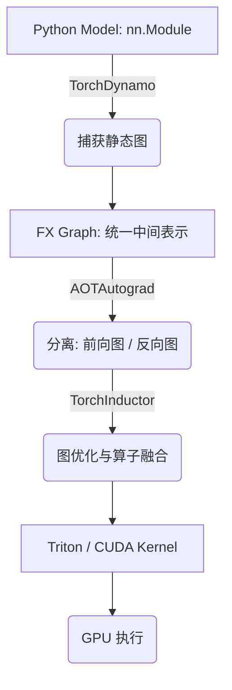
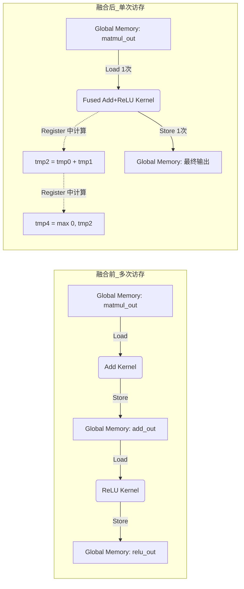

# L8: PyTorch 计算图优化、日志与调试产物

> 本节整理本次关于 `torch.compile`、`TORCH_LOGS`、`TORCH_COMPILE_DEBUG`、`Not enough SMs to use max_autotune_gemm mode` 的完整讨论，并结合 [code/l8-mlp.py](../../code/l8-mlp.py) 说明：一个简单的 MLP 是如何被 TorchDynamo 捕获为计算图，再交给 TorchInductor 做算子融合、kernel 生成与 autotune 的。

---

## 目录

1. [本次对话的主线](#1-本次对话的主线)
2. [程序要点：`code/l8-mlp.py`](#2-程序要点codel8-mlppy)
3. [日志怎么开、怎么读](#3-日志怎么开怎么读)
4. [调试产物与“人类可读”结果](#4-调试产物与人类可读结果)
5. [警告信息：`Not enough SMs to use max_autotune_gemm mode`](#5-警告信息not-enough-sms-to-use-max_autotune_gemm-mode)
6. [背后的计算图优化流程](#6-背后的计算图优化流程)
7. [关键知识点总结](#7-关键知识点总结)
8. [本次实战的最终结论](#8-本次实战的最终结论)

---

## 1. 本次对话的主线

这次对话围绕一个具体问题展开：**如何看懂 PyTorch 2.x 中 `torch.compile` 的编译过程与调试产物**。

我们采取**由表及里**的逻辑：
1. **表层现象**：一个两层 MLP 脚本在运行时抛出了 `Not enough SMs to use max_autotune_gemm mode` 警告。
2. **文本日志**：如何通过开启 `TORCH_LOGS` 阅读编译器运行时的分析与报错。
3. **图与算子（IR）**：如何通过 `TORCH_COMPILE_DEBUG` 获取“人类可读”的图优化和算子融合过程。
4. **底层 Kernel**：最终下发给 GPU 的那个叫作 `output_code.py` 的 Triton 算子代码长什么样，以及它为什么快。

以下我们从代码例子开始，带你拆解这个黑盒。

---

## 2. 程序要点：`code/l8-mlp.py`

这个脚本的任务很简单：**训练一个两层 MLP 去拟合 `sin(x)`**。虽然模型很小，但它正好适合演示 `torch.compile` 的完整流程，因为前向图非常清晰。下面是生成我们本次调试日志（`example_debug_artifacts`）的完整核心代码，并附带了详细的注释解析：

### 2.1 完整实验代码与解析

```python
import torch
import torch.nn as nn
import torch.nn.functional as F

# 定义一个极简的两层感知机 (MLP)
class MLP(nn.Module):
    def __init__(self, feature=1, hidden=64):
        super().__init__()
        # 第一层参数：输入特征维(1) -> 隐藏维(64)
        # 用 nn.Parameter 手动管理权重，便于观察底层对 add/matmul 的处理
        self.weight1 = nn.Parameter(torch.randn(feature, hidden))   # 维度 (F, H)
        self.bias1   = nn.Parameter(torch.randn(hidden))            # 维度 (H,)

        # 第二层参数：隐藏维(64) -> 输出维(1)
        self.weight2 = nn.Parameter(torch.randn(hidden, 1))         # 维度 (H, 1)
        self.bias2   = nn.Parameter(torch.randn(1))                 # 维度 (1,)

    def forward(self, x):
        # 算子集合 1：矩阵乘法 (matmul) + 偏置相加 (add)
        x = x @ self.weight1 + self.bias1   # 形状 (B, H)
        # 算子集合 2：激活函数 (relu)
        # 编译器的一大任务就是考察能否把上面的 add 和这里的 relu 融合 (Fusion)
        x = torch.relu(x)
        # 算子集合 3：第二层计算
        x = x @ self.weight2 + self.bias2   # 形状 (B, 1)
        return x

# =========================
# 配置阶段
# =========================
device = "cuda"
batch_size = 128
torch.manual_seed(0) # 固定随机种子以确保图捕获和生成的kernel具有一致性

# 初始化模型并移至 GPU
model = MLP(hidden=64).to(device)

# ⭐️ 核心关键：使用 torch.compile 开启 PyTorch 2.x 编译加速
# backend="inductor": 使用默认的 OpenAI Triton 作为代码生成后端
# mode="default": 默认模式，追求编译时间和运行性能的平衡 (其余如 max-autotune 会追求极致性能)
model = torch.compile(
    model,
    backend="inductor",
    mode="default",
)

optimizer = torch.optim.Adam(model.parameters(), lr=1e-3)

# =========================
# 训练阶段：拟合 sin(x)
# =========================
for step in range(500):
    # 生成 [0, 2π] 之间的一维随机输入数据作为 x
    x = torch.rand(batch_size, 1, device=device) * 2 * torch.pi  

    # 构造理论真值 y = sin(x)，且不计算梯度
    with torch.no_grad():
        y = torch.sin(x)  # 形状 (B, 1)

    # 前向计算：在此处，TorchDynamo 会在第一次/前几次 step 捕获计算图并触发 Inductor 编译
    out = model(x)

    # 计算均方误差损失
    loss = F.mse_loss(out, y)

    # 反向传播与参数更新：同样地，反向传播的图也会被 AOTAutograd 截获和编译
    optimizer.zero_grad()
    loss.backward()
    optimizer.step()

    if step % 50 == 0:
        print(f"step {step}, loss = {loss.item():.6f}")

print("done")
```

这份代码就是产生后续全部 `DEBUG` 文件的“罪魁祸首”。通过在终端用环境变量包裹这条执行命令：
```bash
TORCH_LOGS="+dynamo,+inductor" TORCH_COMPILE_DEBUG=1 python l8-mlp.py
```
这短短的四五十行代码就会在后台掀起一场“图捕获 -> 图优化 -> 代码生成 (Triton) -> 编译为 .cubin 二进制”的渲染大戏。接下来我们就开始顺藤摸瓜。

---

## 3. 日志怎么开、怎么读

PyTorch 编译调试大致有两种“读法”：

### 3.1 终端文本日志

推荐的启动方式是：

```bash
TORCH_LOGS="+dynamo,+inductor" TORCH_COMPILE_DEBUG=1 python3 l8-mlp.py 2>&1 | tee run.log
```

这里有三个效果：

- `TORCH_LOGS="+dynamo,+inductor"`：把 Dynamo 和 Inductor 的详细过程打印出来。
- `TORCH_COMPILE_DEBUG=1`：把更完整的调试产物导出到 `torch_compile_debug/`。
- `tee run.log`：一边看，一边把终端输出保存到文件，方便回放。

这种日志最适合回答的问题是：

- 有没有成功捕获到图？
- 有没有 graph break？
- 编译器有没有命中缓存？
- 有没有启用 autotuner？
- 某个优化步骤是不是被跳过了？

### 3.2 具体到这次运行的可见信息

这次运行的 `run.log` 里有几个很关键的信号。

第一类是 Inductor / autotune 相关：

```text
Loading 1 statically launchable autotuners
Loading 2 statically launchable autotuners
fx graph cache hit for key ...
Step 2: done compiler function inductor
```

这说明：

- Inductor 确实介入了编译。
- 有静态可启动的 autotuner 被加载。
- 至少有部分图命中了缓存。

第二类是更底层的 emit / bundler 信息：

```text
Bailing out TritonBundler.read_and_emit, ... is non empty
```

这类信息通常不是错误，更像是在告诉你：某个输出目录已经有内容，所以这次没有重复导出。

### 3.3 `torchdynamo/debug.log`

这次生成的 `torchdynamo/debug.log` 更接近“人类可读的 trace”。它直接写出了：

- 哪一行代码开始 tracing
- 读取了哪些参数
- 生成了什么图节点
- 最终的 traced FX Graph 长什么样

日志中最有价值的一段是 traced graph。它把 `MLP.forward` 压缩成了一个明确的算子序列：

```text
matmul -> add -> relu -> matmul -> add
```

这就是后续优化的入口。

---

## 4. 调试产物与“人类可读”结果

你之前记得的“老师展示的那个版本”，基本就是这类导出的调试文件。

### 4.1 典型目录结构

当 `TORCH_COMPILE_DEBUG=1` 生效时，通常会在工程目录下得到类似：

```text
code/torch_compile_debug/
  run_2026_05_05_xxx-pid_xxxx/
    torchdynamo/
      debug.log
    torchinductor/
      aot_model___0_debug.log
      model__0_forward_1.0/
        fx_graph_readable.py
        fx_graph_transformed.py
        ir_pre_fusion.txt
        ir_post_fusion.txt
        output_code.py
      model__0_backward_3.1/
        fx_graph_readable.py
        fx_graph_transformed.py
        ir_pre_fusion.txt
        ir_post_fusion.txt
        output_code.py
```

其中：

- `fx_graph_readable.py`：更接近原始图结构的 FX 表示。
- `fx_graph_transformed.py`：经过图变换后的 FX 图。
- `ir_pre_fusion.txt`：融合前的中间表示。
- `ir_post_fusion.txt`：融合后的中间表示。
- `output_code.py`：最终生成的执行代码，通常最接近实际 kernel。
- `aot_model___0_debug.log`：AOTAutograd 相关调试信息。

### 4.2 什么叫“人类可读”

“人类可读”并不是指最终机器执行的 PTX / SASS，而是指：

- 你能看懂图里有哪些节点。
- 你能看懂哪些算子被合并了。
- 你能看懂前向、反向是如何拆分的。
- 你能看懂哪些张量被中间缓存了。

从教学角度说，最有价值的是这三层：

1. FX Graph：看“原本有哪些算子”。
2. IR post fusion：看“哪些算子被融合在一起”。
3. output_code：看“最后到底生成了什么执行代码”。

### 4.3 这次运行里能直接读出的图结构

从 `torchdynamo/debug.log` 可以直接看到这段前向图：

- 输入 `x`
- `x @ weight1 + bias1`
- `relu`
- `x @ weight2 + bias2`
- 返回输出

这说明这个 MLP 的计算图非常规整，没有复杂控制流，也没有明显 graph break，所以很适合用来观察编译器优化。

---

## 5. 警告信息：`Not enough SMs to use max_autotune_gemm mode`

这条信息很容易让人误解成“程序有问题”，但实际上不是。

### 5.1 这句话的字面意思

它的意思是：**当前 GPU 的 SM 数量不够大，或者当前 GEMM 任务不够大，不值得进入最激进的 `max_autotune_gemm` 调优模式**。

SM 是 Streaming Multiprocessor，可以理解成 GPU 里负责并行计算的基本执行单元。调优模式越激进，意味着：

- 会搜索更多 kernel 变体。
- 会花更多编译时间和 autotune 时间。
- 只有当任务足够大、收益足够明显时才值得。

### 5.2 为什么小 MLP 更容易触发它

你的脚本是一个很小的 MLP：

- batch size = 128
- hidden = 64
- 两个矩阵乘法的形状都不大

这种场景下，矩阵乘法的规模偏小，编译器更容易判断：

- `max_autotune_gemm` 的收益不一定值得它的代价。
- 直接走较保守、较稳定的路径更合适。

所以这条 warning 的本质是：

- **不是报错**
- **不是失败**
- **而是“我不启用最重的搜索模式了”**

### 5.3 对性能意味着什么

这条提示暗示的是一个折中：

- 追求极致性能：开启更激进的 autotune，可能更慢编译，但运行更快。
- 追求稳定和更快编译：跳过激进搜索，直接用保守策略。

对于像你这个脚本这样的小模型，这个折中通常是合理的。

---

## 6. 背后的计算图优化流程

PyTorch 2.x 的 `torch.compile` 不是“魔法开关”，它背后是一条很清晰的流水线。

### 6.1 总流程：从 Python 到 GPU Kernel



这条链路里最关键的思想是：

- 把动态图“先看成图”。
- 在图上做优化，而不是逐行执行 Python。
- 优化完成后再生成更高效的底层 kernel。

### 6.2 TorchDynamo：图捕获

TorchDynamo 的工作是：

- 运行时观察 Python 代码。
- 找出其中的张量运算。
- 把这些运算提取成图。

它做的不是传统意义上的静态编译，而是“尽量在不改用户代码的前提下，把动态图提成图”。

你的日志里有非常直观的一句：

```text
Step 1: torchdynamo start tracing forward ...
```

这意味着：Dynamo 确实开始对 `MLP.forward` 做 tracing 了。

### 6.3 FX Graph：统一中间表示

FX Graph 是 `torch.compile` 体系里非常核心的一层。

它把代码中的张量运算表示成节点和边：

- 节点：算子，例如 `matmul`、`add`、`relu`
- 边：张量数据流

这样后端就可以在统一 IR 上做：

- 图变换
- 节点重排
- 算子融合
- 内存规划

这次日志里展示的 traced graph 就是一个标准 FX 图的例子。

### 6.4 AOTAutograd：前后向拆分

自动求导本身也可以被展开成图。

AOTAutograd 做的事情就是：

- 把前向计算图和反向梯度图拆开。
- 让它们各自独立优化。

这样做的好处是：

- 前向和反向可以采用不同的优化策略。
- 中间张量的生命周期更清楚。
- 更容易安排内存复用与缓存。

### 6.5 TorchInductor：优化与代码生成

TorchInductor 是最终真正把图“落地”的后端。

它会做的事情包括：

- 图级优化
- 算子融合（fusion）
- 调度（scheduling）
- 代码生成

在 GPU 上，TorchInductor 常常会进一步生成 Triton kernel，或者调用底层高性能实现。

### 6.6 算子融合到底在融合什么

算子融合的本质是：

**把多个小算子合并成更少的 kernel，减少中间张量读写和 launch 开销。**

对于这个 MLP 来说，最容易被优化的地方是：

- `matmul + bias`
- `relu`
- 下一层 `matmul + bias`

其中点wise 操作（`add`、`relu`）最适合融合；矩阵乘法通常是主算子，往往与 epilogue 结合或在相邻调度中处理。

优化目标主要有三个：

1. 减少 kernel 数量。
2. 减少 global memory 的中间读写。
3. 提高缓存利用率和执行吞吐。

---

## 7. 深入解析 `output_code.py` (算子融合实战)

在先前的调试中，TorchInductor 最终生成的代码落在全局缓存目录（如 `/tmp/torchinductor_$USER/gj/`）中。我们已将其拷贝到了本笔记同级目录下：[output_code.py](output_code.py)。

### 7.1 引言：为什么 debug 目录下找不到 output_code？
有时 `torch_compile_debug` 目录下的 `output_code.py` 会缺失或是一个空文件，这是因为 Inductor 会根据计算图的 hash 命中缓存，直接将最终生成的 Triton 代码输出到系统全局缓存目录。通过日志可以顺藤摸瓜找到它。

### 7.2 剖析生成的 Triton Kernel
从 [output_code.py](output_code.py) 中，我们可以清楚地看到**算子融合（Operator Fusion）**的具体实现。注意看这段核心代码：

```python
@triton.jit
def triton_poi_fused_add_relu_0(in_out_ptr0, in_ptr0, xnumel, XBLOCK : tl.constexpr):
    xnumel = 8192
    xoffset = tl.program_id(0) * XBLOCK
    xindex = xoffset + tl.arange(0, XBLOCK)[:]
    xmask = tl.full([XBLOCK], True, tl.int1)[:]
    x2 = xindex
    x0 = (xindex % 64)
    
    # 1. Load: 读取前一层 matmul 的输出 (in_out_ptr0) 和 bias (in_ptr0)
    tmp0 = tl.load(in_out_ptr0 + (x2), None)
    tmp1 = tl.load(in_ptr0 + (x0), None, eviction_policy='evict_last')
    
    # 2. Compute: add 计算 (x + bias1)
    tmp2 = tmp0 + tmp1
    
    # 3. Compute: relu 计算 (即 maximum(0, x))
    tmp3 = tl.full([1], 0, tl.int32)
    tmp4 = triton_helpers.maximum(tmp3, tmp2)
    
    # 4. Store: 统一写回 global memory
    tl.store(in_out_ptr0 + (x2), tmp4, None)
```

#### Graph Fusion 的直观图示


**核心结论与优势：**
- **融合了什么：** 编译器自动把 `add`（加上 bias）和 `relu`（非线性激活）合并进了一个名为 `triton_poi_fused_add_relu_0` 的 Pointwise 算子中。
- **性能为什么提升：** 
  - **如果不融合：** 需要先算加法，结果写回 Global Memory；再启动一个 ReLU kernel，从 Global Memory 把数据读出来，判断大于 0后再写回。这涉及两次慢速的 Global Memory 读写。
  - **融合之后：** 加法结果 `tmp2` 到 ReLU 结果 `tmp4` 全程**都在寄存器（Registers）里发生**，极大砍掉了访存开销，这也是图优化带来的“免费午餐”。

---

## 8. 关键知识点总结

### 7.1 计算图（Computation Graph）

深度学习模型的前向与反向过程可以抽象为 DAG：

- 节点表示算子。
- 边表示张量依赖。
- 只要控制流足够稳定，就能把运行时行为提成图进行优化。

### 7.2 图优化的目标

图优化不是为了改变语义，而是为了在语义不变的前提下提高性能：

- 算子融合
- 中间结果复用
- 减少内存访问
- 降低 kernel launch 开销

### 7.3 `torch.compile` 的几个重要参数

#### `backend="inductor"`

指定后端为 TorchInductor。它是 PyTorch 2.x 默认的高性能编译后端之一。

#### `mode="default"`

默认模式，在编译开销与运行性能之间做平衡。

常见模式还包括：

- `reduce-overhead`：减少编译和 Python 调度开销，适合小模型或频繁调用。
- `max-autotune`：更激进的 kernel 搜索，通常编译更慢，但可能跑得更快。

#### `fullgraph=False`

是否强制完整捕获计算图。

- `True`：一旦出现 graph break 就报错。
- `False`：更灵活，兼容性更好。

#### `dynamic=False`

是否支持动态 shape。

- `True`：输入形状允许变化。
- `False`：更利于静态优化与融合。

### 7.4 `TORCH_COMPILE_DEBUG=1` 的价值

它是看“人类可读结果”的关键。

如果没有它，你通常只能看到编译器的普通执行结果；有了它，你可以进一步观察：

- 捕获到的图
- 图变换后的图
- 融合前后的 IR
- 最终生成的代码

### 7.5 `SM`、`GEMM` 与 autotune

- `SM` 决定了 GPU 的并行吞吐能力。
- `GEMM` 是深度学习里最核心的矩阵乘法模式。
- autotune 的目标是找到最优的 kernel 配置。

但 autotune 是有成本的，所以：

- GPU 太小，不一定值得开最重的搜索模式。
- 矩阵太小，不一定能从极致调优中获益。

这就是 `Not enough SMs ...` 这类提示的背景。

### 7.6 这次 `l8-mlp.py` 的图结构为什么清晰

这个脚本没有复杂分支，没有数据依赖上的不确定性，也没有动态控制流，所以：

- TorchDynamo 很容易完整捕获前向图。
- FX Graph 很整齐。
- Inductor 很容易做基本优化和缓存。

这也是它非常适合作为入门示例的原因。

---

## 9. 本次实战的最终结论

### 8.1 结构解读

(原节结束)

---

## 10. `torch_compile_debug` 目录树与 Debug 产物解析

通过在终端中清理缓存并重新运行，我们可以强制 `TorchInductor` 将中间产物写出，得到完整的调试目录树。我已经用代码替你在实验目录生成并导出了一份标准结果，你可以到 [example_debug_artifacts](example_debug_artifacts/) 下面看看。

这个目录树就是典型的“白盒化”结构：

```text
|-- aot_model___0_debug.log              # AOTAutograd 调试日志：记录了前向反向计算图如何拆分
|-- model__0_forward_1.0/                # 前向计算图编译结果
|   |-- fx_graph_readable.py             # FX Graph（前向）：直接捕获自 Python，也就是“模型原来的样子”
|   |-- fx_graph_transformed.py          # 优化后的 FX Graph：经过各种常量折叠、冗余算子消除后的高级图表示
|   |-- ir_pre_fusion.txt                # fusion 前 IR 表示：Inductor 将 FX 翻译成底层 IR，但还没开始做算子融合
|   |-- ir_post_fusion.txt               # fusion 后 IR 表示：算子融合过程后的 IR，观察 add 和 relu 如何被安排在同一层计算
|   |-- output_code.py                   # 生成的 kernel 代码：这就是真正下发给 GPU 跑的 Triton 代码了
`-- model__0_backward_3.1/               # 反向计算图编译结果（反向传播由于自动微分会计算梯度，这部分往往更复杂）
    |-- fx_graph_readable.py             # FX Graph（反向）
    |-- fx_graph_transformed.py          # 优化后的 FX Graph
    |-- ir_pre_fusion.txt                # fusion 前 IR 表示
    |-- ir_post_fusion.txt               # fusion 后 IR 表示
    `-- output_code.py                   # 生成的 kernel 代码
```

### 10.1 这个目录结构告诉我们什么？
1. **分级降阶（Lowering）的思想**：你写的是纯 Python，TorchDynamo 把它编译成 `FX Graph` (也是 Python)；然后再降阶到 Inductor IR；接着做算子融合 (post_fusion)；最后再生成 `Triton kernel (output_code)`。
2. **前后向拆分（AOTAutograd）**：`torch.autograd` 原本是在运行时动态建图，而加上 `torch.compile` 后，整个 forward 和 backward 的算子链路都被静态地分析出并写到了 `model__0_forward` 和 `model__0_backward` 两个不同的子目录中。

---

## 11. 课后作业 (Homework)

### 作业 1：手动触发与观察缓存命中 (Cache Hit)
1. **清理缓存**：首先在终端运行 `rm -rf /tmp/torchinductor_$(whoami)`。
2. **执行并观察生成新代码**：使用以下命令跑一次您的脚本，注意观察 `torch_compile_debug` 里面此时会生成完整的新文件，包括 `output_code.py`。
   ```bash
   cd ~/code/ 
   TORCH_COMPILE_DEBUG=1 python3 l8-mlp.py
   ```
3. **再次执行并观察缓存行为**：**立刻再执行一次相同的命令**。这一次去新生成的 `torch_compile_debug/run_*` 里找 `output_code.py`。你会发现里面可能只有一些空文件或者是被截断的内容！
4. **思考题**：翻看两次运行分别输出的终端日志，找一句含有 `fx graph cache hit` 或类似 `Bailing out TritonBundler.read_and_emit` 字样的日志。请用自己的话描述：PyTorch 是如何避免对不变的计算图重复进行昂贵的 Triton 编译的？

### 作业 2：解读 `output_code.py` 性能玄机
打开 [example_debug_artifacts/model__0_forward_1.0/output_code.py](example_debug_artifacts/model__0_forward_1.0/output_code.py)（或你本地刚才生成的版本）：
1. 找出里面代表 Triton Kernel 的 Python 函数（通常形如 `def triton_poi_fused_add_relu_...`）。
2. 请解释这个单一 Kernel 里面，一共执行了哪**两步**数学操作？
3. 如果这部分没有这套代码自动生成工具，作为开发者，你需要手写几个 Kernel？需要多少次 Global Memory 的读写？算出粗略的节省比例。

---

## 12. 本次实战的宏观总结

### 🗂️ 1. 我们解决了那些常见的困惑？
- **“Warning != Error”**：`Not enough SMs` 仅仅是 Inductor 的策略提示，表明小规模矩阵不配开启高昂开销的极致调优。
- **“被隐藏的代码”**：Torch 编译器其实在背后写代码，我们学会了用 `TORCH_COMPILE_DEBUG=1` 把它们逼到前台抓现行。
- **缓存重用机制**：Inductor 不会做无用功。一旦 Graph 是确定的，生成的 Python Wrapper 和 Triton Kernel 会直接放到 Cache 里并跳过重编译。

### 🚀 2. 算子融合 (Operator Fusion) 对 AI 底层的意义
从 `output_code` 我们窥见了编译优化的杀手锏。算子融合并非改变了数学公式，而是在玩一个**“尽量让数据只待在寄存器里，少去 Global Memory 洗澡”**的游戏。对于现代显存带宽受限（Memory Bound）的 GPU 计算，这通常比单纯提高算力具有更大的边际收益。这，也就是 Triton 让深度学习性能起飞的核心武器之一。

### 8.1 对“日志怎么看”的结论

如果你想看编译过程本身，优先看：

- `run.log`
- `torchdynamo/debug.log`

如果你想看更“图化”的优化结果，优先看：

- `fx_graph_readable.py`
- `fx_graph_transformed.py`
- `ir_pre_fusion.txt`
- `ir_post_fusion.txt`
- `output_code.py`

### 8.2 对“Not enough SMs ...”的结论

它的意思不是出错，而是：

- 当前场景不适合启用最激进的 GEMM autotune。
- 编译器选择了更保守、更稳定的策略。

### 8.3 对“torch.compile 背后原理”的结论

`torch.compile` 的核心不是简单加速，而是把原本在 Python 中逐条执行的张量操作：

1. 先捕获成图，
2. 再在图上做优化，
3. 最后生成更高效的 GPU kernel。

### 8.4 对这份 MLP 脚本的结论

这个脚本虽然很短，但它已经完整展示了 PyTorch 2.x 编译体系的关键链路：

- Python 模型
- TorchDynamo tracing
- FX Graph 中间表示
- AOTAutograd 拆分前后向
- TorchInductor 优化与代码生成
- autotune / cache / fusion

所以它是一个非常适合拿来理解“计算图优化”的最小例子。

---

## 附：本次调试命令

```bash
TORCH_LOGS="+dynamo,+inductor" TORCH_COMPILE_DEBUG=1 python3 l8-mlp.py 2>&1 | tee run.log
```

如果想只看更完整的 debug 目录，可以直接搜索：

- `code/torch_compile_debug/run_2026_05_05_14_25_21_889084-pid_14363/torchdynamo/debug.log`
- `code/torch_compile_debug/run_2026_05_05_14_25_21_889084-pid_14363/torchinductor/`

如果后续再跑一次，目录名里的时间戳和 pid 会变化，但结构基本不变。